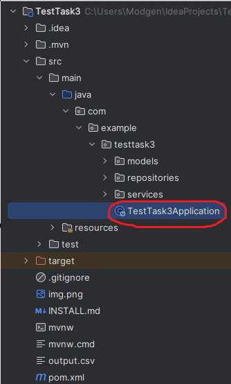
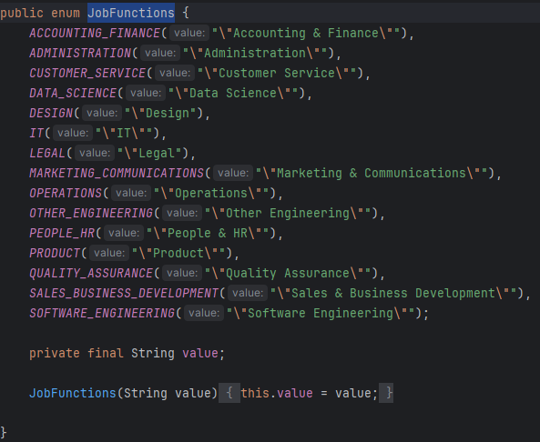

### Як працює?

Все налаштування застосунку відбувається тут:

Тут ми працюємо лише із списком енамів типу JobFunctions:

Вони є нашими JobFunctions які будуть фільтрувати список вакансій на сайті, далі на основі цих JobFunctions формується url який ми використовуватимемо для скрапінгу, сам скрапінг та збереження до бд данних що ми отримали.